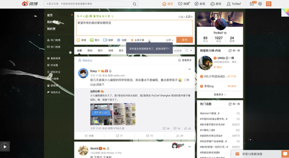

#   微博网页端简洁化
##  使用方法
*   下载到本地解压
*   进入Chrome的“扩展程序页面”，并开启 “开发者模式”
*   点击“加载已解压的扩展程序”选择本项目
*   进入微博网页端，自动加载功能

# 个性化部分
1. 删删删：
* 页面右侧整个竖排，右上角发送微博钮
* 搜索栏内  点击后触发的下拉菜单
* 微博发布框右上角的话题
* 顶部导航栏 右侧“首页视频发现游戏”
* 点进去个人页面，右侧“相关推荐”
* 微博发布框，下方“···”菜单
* 搜索栏内 默认内容

2. feed流透明度
3. 微博发布栏上方字体居中
4. 搜索框居中
5. 主体部分横向拉伸
6. 改微博发布栏默认内容+上方默认文字

前后效果对比

* * *

借用了 LazyExtKit Chrome 插件新手包。
